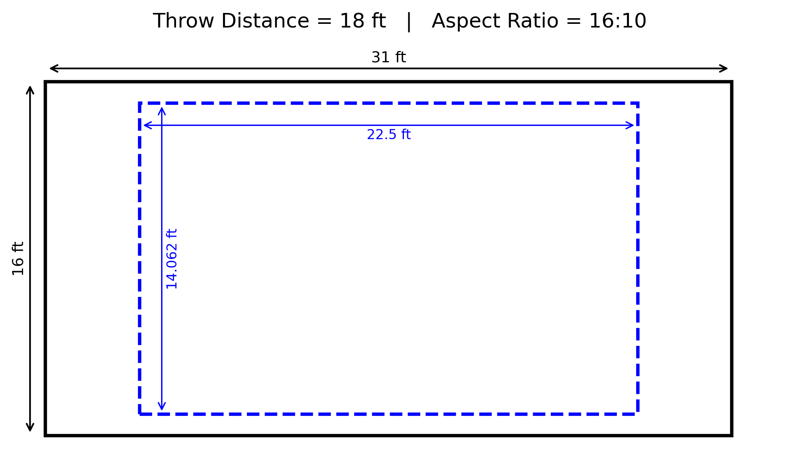
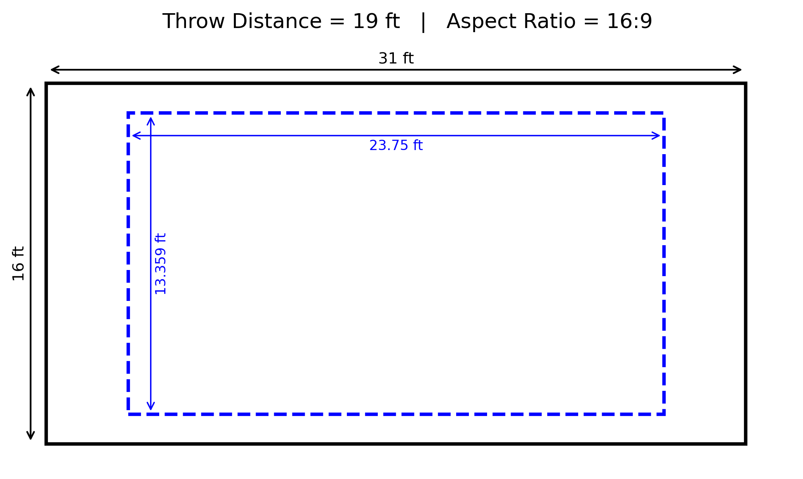
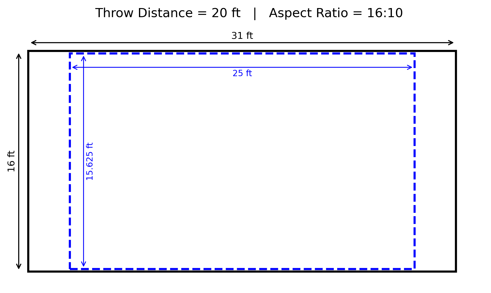

<p align="center">
  <h1 align="center">ThrowViz</h1>
  <p align="center">
    A small tool for visualizing projector throw distances and screen coverage
  </p>
</p>

<p align="center">
  
  
</p>

---

ThrowViz is a small Python tool that helps visualize projector throw
distances and screen coverage.

It generates simple diagrams that show how a projected image fits on a
surface at different distances. This can be useful when planning
installations, testing projector throw ratios, or explaining setups to
clients.

The tool can run either as a small GUI application or from the command
line. It produces PNG images that illustrate the projection area for the
given parameters.

## Features

-   Visualize projection coverage at specific distances
-   Generate a series of images across a distance range
-   Simple GUI for quick testing
-   Command line support for automation
-   Outputs clean PNG diagrams

## Installation

Clone the repository:

``` bash
git clone https://github.com/danyalziakhan/throwviz.git
cd throwviz
```

Create a virtual environment if desired:

``` bash
python -m venv .venv
```

Activate it (Windows):

``` bash
.venv\Scripts\activate
```

Install dependencies:

``` bash
pip install -r requirements.txt
```

## Running the GUI

The easiest way to use the tool is the GUI.

``` bash
run_gui.bat
```

Or manually:

``` bash
python main.py --gui
```

The GUI allows you to enter:

-   Surface width
-   Surface height
-   Throw ratio
-   Distance from projector
-   Aspect ratio
-   Output directory

Press generate and the visualization will be saved as an image.

## Command Line Usage

You can also generate images directly from the command line.

Example:

``` bash
python main.py \
  --surface-width 12 \
  --surface-height 7 \
  --throw 1.8 \
  --distance 18 \
  --aspect 16:9 \
  --out output
```

This will generate a projection visualization for an 18 ft distance.

## Distance Series

To generate multiple images across a range of distances:

``` bash
python main.py \
  --surface-width 12 \
  --surface-height 7 \
  --throw 1.8 \
  --distance-series 18-25 \
  --aspect 16:9 \
  --out output
```

This will create images for every distance from 18 ft to 25 ft.

## Output

Generated images are stored in the `output` folder. Each image
represents the projection area at a specific distance.

Example:

``` text
output/
18ft.png
19ft.png
20ft.png
```

## Example Images

<p align="center">
  
  
  
</p>

## Why this tool exists

Projector planning often requires quick visual checks. Throw ratio
calculations alone do not always make it easy to explain how the
projection fits inside a real surface. ThrowViz was written to quickly
generate visual references instead of doing the same calculations
repeatedly.

## License

MIT License
